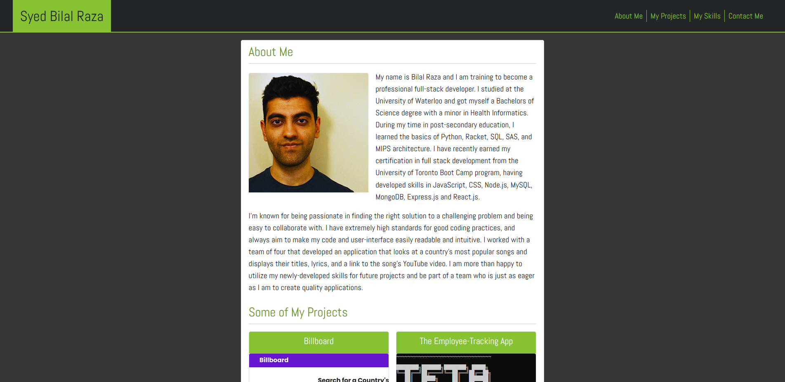
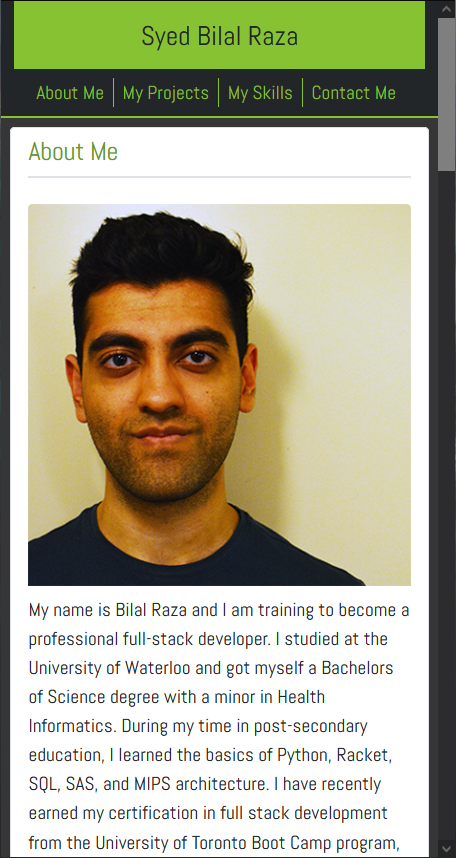

# My Portfolio V2.0

## Description

A new and improved portfolio for myself! My previous one was not up to quality, and broke when viewed on mobile. 

> Github Repository Link: [https://github.com/Bickolus/portfolio-v2](https://github.com/Bickolus/portfolio-v2)
>
> Deployed Link: [https://bickolus.github.io/portfolio-v2/](https://bickolus.github.io/portfolio-v2/)

## Table of Contents

1. [Usage](#usage)
2. [License](#license)
3. [Screenshots](#screenshots)
4. [Questions](#questions)

## Usage

Just click on the deployed link and check it out!

## License

This project is under the "Unlicense" license.

## Screenshots

### 1080p Monitor:

### Mobile (smallest width possible):

## Questions

My GitHub Page: [Bickolus](https://github.com/Bickolus)

If you have any additional questions, please contact me at smbraza97@gmail.com.